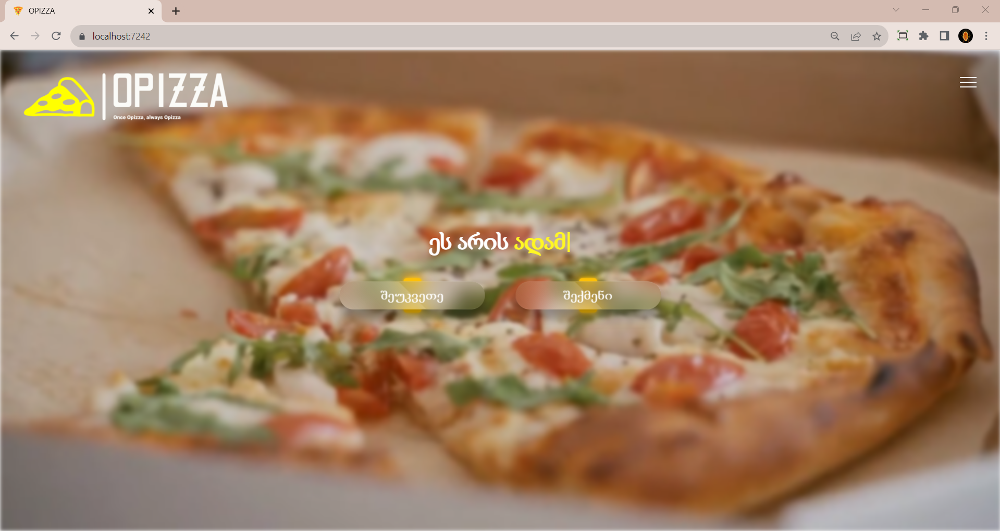

# OPizza - Restaurant Website

OPizza is a dynamic full-stack restaurant website project developed using ASP.NET. This repository houses the codebase for OPizza, an online platform that enables users to explore a delectable range of pre-made pizzas and empowers them to craft their own culinary creations. The project showcases end-to-end web development skills, making it a perfect candidate for those looking to delve into full-stack application development.

## Table of Contents

- [Introduction](#introduction)
- [Features](#features)
- [Installation](#installation)
- [Usage](#usage)
- [Authentication and Authorization](#authentication-and-authorization)
- [Admin Panel](#admin-panel)
- [API - OPizzaAPI](#opizzaapi)
- [Contributing](#contributing)
- [License](#license)

## Introduction

Introduce your project here. Explain what OPizza is all about, its goals, and its significance in the context of web development. You can mention its features and benefits briefly in this section.

## Features

List the key features of OPizza. For example:
- Browse a variety of pre-made pizzas.
- Create custom pizzas with a range of ingredients.
- Authentication system for user accounts.
- Role-based authorization for user and admin roles.

## Installation

Provide instructions on how to set up and install the project locally. Include any prerequisites, steps, or dependencies required for the installation process.

## Usage

Explain how users can interact with your application. This could involve steps on browsing pizzas, creating custom pizzas, placing orders, and more.

## Authentication and Authorization

Detail how the authentication and authorization systems work in your project. Explain the role-based access control and how different roles (users and admins) have different permissions.

## Admin Panel

Describe the admin panel functionality. Highlight tasks that administrators can perform, such as managing orders, editing pizzas, and more.

## API - OPizzaAPI

If applicable, provide information about the API (OPizzaAPI) [APIDocumentation](https://github.com/whosNikoloz/OPizzaAPI.git) associated with the project. Explain how to use the API, including endpoints and their purposes.

## Contributing

Provide guidelines for others who might want to contribute to your project. Explain how they can set up a development environment and submit their contributions.

## License

Include licensing information for your project. Mention the type of license your project is released under and any additional terms.

---

Feel free to customize and expand upon the sections as needed to best represent your project. Good luck with your OPizza project!

